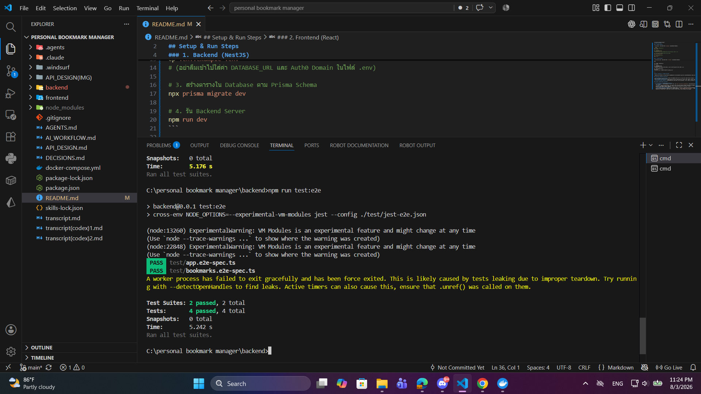

"# Personal-bookmark-manager" 
## Setup & Run Steps

### 1. Backend (NestJS)

เปิด Terminal เข้าไปที่โฟลเดอร์ `backend/` แล้วรันคำสั่งตามลำดับ:

```bash
# 1. ติดตั้ง Dependencies
npm install

# 2. คัดลอกไฟล์ .env
cp .env.example .env
# (อย่าลืมเข้าไปใส่ค่า DATABASE_URL และ Auth0 Domain ในไฟล์ .env)

# 3. สร้างตารางใน Database ตาม Prisma Schema
npx prisma migrate dev

# 4. รัน Backend Server
npm run dev
```

### 2. Frontend (React)

เปิด Terminal ใหม่ เข้าไปที่โฟลเดอร์ `frontend/` แล้วรันคำสั่งตามลำดับ:

Bash

```
# 1. ติดตั้ง Dependencies
npm install

# 2. คัดลอกไฟล์ .env
cp .env.example .env
# (อย่าลืมเข้าไปกำหนดค่า Auth0 Domain, Client ID และ Backend API URL ในไฟล์ .env)

# 3. รัน Frontend Server
npm run dev
# (หรือ npm start ขึ้นอยู่กับคำสั่งใน package.json)
```

## Testing (การทดสอบระบบ)

### Backend Testing (NestJS + Prisma)

ระบบ Backend มีการตั้งค่า Testing Environment ร่วมกับ Jest และ Prisma โดยครอบคลุมทั้ง Unit Test และ E2E Test (ผ่าน Supertest) เพื่อตรวจสอบ Business Logic และการทำงานของ Database

ไปที่โฟลเดอร์ `backend/` แล้วรันคำสั่งต่อไปนี้:

Bash

```
$ npm run test:e2e
```

ตัวอย่าง



---

## What I Completed vs. Skipped (and Why)

เพื่อให้การประเมินผลตรงกับ Scope ที่โฟกัส นี่คือรายการฟีเจอร์ที่พัฒนาจนเสร็จสมบูรณ์ และส่วนที่ตัดสินใจข้ามไปพร้อมเหตุผลครับ:

### Completed (ส่วนที่ทำเสร็จสมบูรณ์)

- **ระบบ Authentication ด้วย Auth0:** ติดตั้งและเชื่อมต่อ Auth0 ทั้งระบบสำเร็จสมบูรณ์ รวมถึงการสร้าง Endpoint `GET /me` สำหรับจัดการข้อมูลเซสชันของผู้ใช้งาน
- **ระบบ Bookmark (Core Feature):** พัฒนา Backend API รองรับ CRUD Operations (Create, Read, Update, Delete) สำหรับ Bookmark ครบถ้วน
- **Frontend UI สำหรับ Bookmark:** พัฒนาส่วนหน้าบ้าน (React/MUI) ให้ผู้ใช้สามารถดู เพิ่ม ลบ และแก้ไข Bookmark ของตนเองได้อย่างสมบูรณ์

### Skipped (ส่วนที่ข้ามไป และเหตุผล)

- **ระบบ Collections (การจัดหมวดหมู่ Bookmark):**
    - **สิ่งที่ข้าม:** ข้ามการพัฒนาลอจิกเชิงลึกของ API (เช่น `GET /collections/:id/bookmarks`) และข้ามการสร้างหน้า UI Collection Page ฝั่ง Frontend
    - **เหตุผล:** เนื่องจากจุดประสงค์หลัก (Core Value) ของแอป "Personal Bookmark Manager" คือการที่ผู้ใช้สามารถบันทึกลิงก์ต่างๆ และกลับมาเปิดดูได้อย่างปลอดภัย จึงตัดสินใจเทเวลาไปโฟกัสที่การทำ Bookmark Service และระบบ Authen ให้แข็งแรงและใช้งานได้จริงก่อนเป็นอันดับแรก
    - **สิ่งที่ทำทิ้งไว้ (ทดสอบ AI Agent):** แม้จะข้ามลอจิกหลักของ Collection ไป แต่ได้ทำการ Generate ตัว Resource โครงสร้างพื้นฐานเตรียมไว้แล้ว โดยมีจุดประสงค์เพื่อทดสอบรันคำสั่ง `.agent command create new resource` เพื่อดูว่า AI สามารถจำรูปแบบและนำมา Reuse เป็นสแกฟโฟลด์ (Scaffold) สำหรับ Resource ใหม่ๆ ได้อย่างถูกต้องหรือไม่